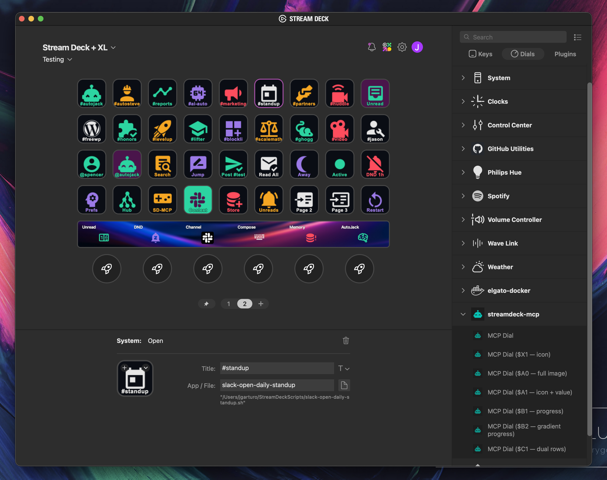

# Stream Deck MCP

<!-- mcp-name: io.github.verygoodplugins/streamdeck-mcp -->

Tell your AI what kind of Stream Deck you want. Get back a fully authored profile — buttons, icons, colors, dials, and the shell scripts behind them.

streamdeck-mcp is the bridge: an MCP server that reads and writes Elgato Stream Deck profiles directly, in the format the desktop app already uses. Themed decks, per-project layouts, app-specific control boards — built in a single prompt instead of an hour in the GUI. Works with Claude Desktop, Claude Code, Cursor, Codex, and any MCP-compatible client.



> Asked Claude Desktop for *"a Slack control board"* — got back this profile. Buttons, icons, colors, and dials all authored in one shot via the MCP server.

## What you can build

The decks aren't generic. When other MCP servers are loaded — Slack, Home Assistant, OBS, GitHub, Hue, the ones you already use — your AI queries them first to discover *your* channels, *your* devices, *your* scenes, then authors a deck around what's actually there. Icons render to match (~7,400 Material Design Icons bundled offline, or freeform text), so every button looks like it belongs. No Stream Deck SDK, no plugin authoring — just shell scripts and a prompt.

A few worth trying:

- ***"Make me a control board for Slack."***
  → Queries your Slack MCP for channels, status, and unread state. Generates one channel-jump button per channel you actually use, status toggles (Active / Away / DND), a Read-All, and dials for unread counts. The screenshot above is one such result.

- ***"A hello-kitty-themed Home Assistant dashboard for the living room."***
  → Pulls Home Assistant entities scoped to the living room area, then lays them out in pastel kawaii — scenes on row one, lights on row two, media on row three. Palette and icon style follow the theme.

- ***"OBS control panel based on my actual scenes and audio inputs."***
  → Queries OBS for scenes, sources, and audio devices. Generates scene-switch buttons with the right transitions, source toggles, and dials for per-input gain on the touch strip.

- ***"A dev deck for this repo in Nordic colors."***
  → Reads your project's scripts (npm, Make, just — whatever's there), recent PRs via the GitHub MCP, and the local docs structure. Drops shell-script buttons for the most-used commands, PR/CI jumps, and a Nordic-palette icon set.

- ***"A 'Friday demo' deck: open Zoom, mute Slack, set Hue to 'focus', start a screen recording."***
  → Composes across whatever MCPs you have loaded. Writes one shell script per action to `~/StreamDeckScripts/` and wires them to a single page with custom icons.

Same pattern every time: ask, your AI inventories your hardware and your other MCPs, plans the layout, generates icons, writes the profile files, restarts the Elgato app. Iteration is free — tweak the prompt, get a different deck.

## How it works

1. **Install the MCP server** in your AI client (snippets below).
2. **Install the designer skill** in Claude Code, or invoke the `design_streamdeck_deck` MCP prompt in any other client.
3. **Ask for a deck.** Your AI calls `streamdeck_read_profiles` to inventory the hardware, plans the layout, generates icons (~7,400 Material Design Icons bundled offline, or freeform text), writes the profile files, and restarts the Elgato app so the device picks up the changes.

## Install

The packaged entrypoint is `streamdeck-mcp`, run via [`uvx`](https://docs.astral.sh/uv/). It edits the desktop app's `ProfilesV3` files when present and falls back to `ProfilesV2`.

### Cursor

[](cursor://anysphere.cursor-deeplink/mcp/install?name=streamdeck&config=eyJjb21tYW5kIjoidXZ4IiwiYXJncyI6WyJzdHJlYW1kZWNrLW1jcCJdfQ==)

Or paste into `~/.cursor/mcp.json`:

```json
{
  "mcpServers": {
    "streamdeck": {
      "command": "uvx",
      "args": ["streamdeck-mcp"]
    }
  }
}
```

### Claude Desktop

Paste into `~/Library/Application Support/Claude/claude_desktop_config.json` (macOS) or `%APPDATA%\Claude\claude_desktop_config.json` (Windows), then restart Claude Desktop:

```json
{
  "mcpServers": {
    "streamdeck": {
      "command": "uvx",
      "args": ["streamdeck-mcp"]
    }
  }
}
```

### Claude Code

```bash
claude mcp add streamdeck -- uvx streamdeck-mcp
```

### OpenAI Codex

Add to `~/.codex/config.toml`:

```toml
[mcp_servers.streamdeck]
command = "uvx"
args = ["streamdeck-mcp"]
```

### Other MCP clients

Anything that speaks MCP over stdio works the same way — point it at `uvx streamdeck-mcp`. The JSON snippet above is the canonical shape.

### Note for Linux users

The default profile writer needs the Elgato Stream Deck desktop app, which is macOS- and Windows-only. On Linux, use the legacy USB-direct server instead — see [Legacy USB mode](#legacy-usb-mode) below.

## The `streamdeck-designer` skill

streamdeck-mcp ships with an **Agent Skill** that teaches Claude (in Claude Code) how to plan, theme, and author full decks end-to-end. The skill covers:

- **Hardware inventory** — always calls `streamdeck_read_profiles` first, then matches authoring style to your model.
- **Palette + typography planning** — 8 theme archetypes (kawaii, retrowave, brutalist, nordic, terminal, nature, minimal, corporate) with ready palettes and per-strategy icon-color guidance.
- **Dials + touchstrip** — decision tree for + / + XL encoder layouts (`$X1` / `$A0` / …).
- **Integration recipes** — per-service patterns for Hue, OBS, Spotify, Home Assistant, Twitch, shell, browser. Credentials live in `~/StreamDeckScripts/.env`, never baked into scripts.
- **Starter recipes** — streamer/hello-kitty (+ XL), dev/Nordic (XL), music/retrowave (Original) as adaptation shapes.

### Install the skill (Claude Code)

```bash
uvx --from streamdeck-mcp streamdeck-mcp-install-skill
```

The skill is copied to `~/.claude/skills/streamdeck-designer/`. Restart Claude Code (or start a new session) and it auto-loads when your request matches a deck-design intent. Re-run with `--force` to upgrade after a version bump.

### Other MCP clients

Clients that don't load Claude Code skills (Claude Desktop, Cursor, Codex, …) get a condensed mirror via the **`design_streamdeck_deck`** MCP prompt. Most clients expose it as a slash command or prompt picker — invoke it before describing the deck you want, and pass the user's intent via the `intent` argument if your client supports it.

## Tools

| Tool | What it does |
|------|---------------|
| `streamdeck_read_profiles` | Lists desktop profiles and page directories from the active ProfilesV3 or ProfilesV2 store |
| `streamdeck_read_page` | Reads a page manifest and returns simplified button details plus the raw manifest |
| `streamdeck_write_page` | Creates a new page or rewrites an existing page manifest |
| `streamdeck_create_icon` | Generates a PNG icon from a Material Design Icons name (e.g. `mdi:cpu-64-bit`) or from text — provide one or the other, not both. `shape="button"` (72×72, default) for keypad keys and dial faces; `shape="touchstrip"` (200×100) for + / + XL touch strip backgrounds. ~7,400 MDI icons are bundled offline; unknown names return close-match suggestions |
| `streamdeck_create_action` | Creates an executable shell script in `~/StreamDeckScripts/` and returns an Open action block |
| `streamdeck_restart_app` | Restarts the Stream Deck desktop app after profile changes (macOS only — raises on other platforms) |
| `streamdeck_install_mcp_plugin` | Installs the bundled streamdeck-mcp Stream Deck plugin into the Elgato Plugins directory. `streamdeck_write_page` auto-installs it the first time an encoder needs it, so direct use is rarely required |

## Editing workflow

The Elgato desktop app keeps every profile in memory and rewrites the on-disk manifests from that snapshot when it quits — so any edit made while the app is running is wiped the next time it closes. The profile writer enforces a quit → write → relaunch cycle:

1. Ensure the Elgato app is not running, or pass `auto_quit_app: true` to `streamdeck_write_page` to have it quit the app for you (AppleScript first, `killall` fallback).
2. Make as many `streamdeck_write_page` calls as you need — the app stays quit between them.
3. Call `streamdeck_restart_app` when you're done. The device re-reads the manifests on launch and your changes appear.

`streamdeck_write_page` raises `StreamDeckAppRunningError` when the app is running and `auto_quit_app` isn't set, so you can't accidentally write changes that get silently discarded.

**Platform support.** The running-app guard, `auto_quit_app`, and `streamdeck_restart_app` are macOS-only. On Windows the Elgato app still clobbers manifests on close, so you'll need to quit it manually before authoring and relaunch it after — `auto_quit_app: true` is silently a no-op on non-macOS, and `streamdeck_restart_app` errors.

If your Elgato app lives somewhere other than `/Applications/Elgato Stream Deck.app`, set `STREAMDECK_APP_PATH` to the bundle path.

## Under the hood

- **`ProfilesV3` is preferred** when present (page UUIDs map cleanly to directories). `ProfilesV2` is still supported, but existing pages should be targeted by `directory_id` or `page_index` because Elgato uses opaque directory names there.
- **Native action objects** are accepted directly by `streamdeck_write_page`, alongside convenience fields like `path`, `action_type`, `plugin_uuid`, and `action_uuid`.
- **Generated icons** live in `~/.streamdeck-mcp/generated-icons/`. **Generated shell scripts** live in `~/StreamDeckScripts/`.
- **The bundled streamdeck-mcp plugin** is installed into the Stream Deck Plugins directory (e.g., `~/Library/Application Support/com.elgato.StreamDeck/Plugins/` on macOS, `%APPDATA%\Elgato\StreamDeck\Plugins\` on Windows). It's a minimal shell whose only job is to declare encoder support so per-instance `Encoder.Icon` / `Encoder.background` writes survive an Elgato app restart.

## Legacy USB mode

The original USB-direct server is preserved for backwards compatibility — useful when you'd rather have the MCP server own the hardware directly (Linux, headless setups, or environments where the Elgato app isn't running). It exposes a different tool surface focused on direct hardware control:

`streamdeck_connect`, `streamdeck_info`, `streamdeck_set_button`, `streamdeck_set_buttons`, `streamdeck_clear_button`, `streamdeck_get_button`, `streamdeck_clear_all`, `streamdeck_set_brightness`, `streamdeck_create_page`, `streamdeck_switch_page`, `streamdeck_list_pages`, `streamdeck_delete_page`, `streamdeck_disconnect`.

Run via:

```bash
uvx --from streamdeck-mcp streamdeck-mcp-usb
```

In a client config, keep `"command": "uvx"` and use `"args": ["--from", "streamdeck-mcp", "streamdeck-mcp-usb"]`.

## Development

```bash
git clone https://github.com/verygoodplugins/streamdeck-mcp.git
cd streamdeck-mcp
uv venv && uv pip install -e ".[dev]"
uv run pytest tests/ -v
uv run ruff check .
```

To audit this repo against the shared Very Good Plugins MCP standards:

```bash
../mcp-ecosystem/scripts/audit-server.sh .
```

## Support

For issues, questions, or suggestions:

- [Open an issue on GitHub](https://github.com/verygoodplugins/streamdeck-mcp/issues)
- [Contact Very Good Plugins](https://verygoodplugins.com/contact/?utm_source=github)

---

Built with 🧡 by [Very Good Plugins](https://verygoodplugins.com/?utm_source=github)
